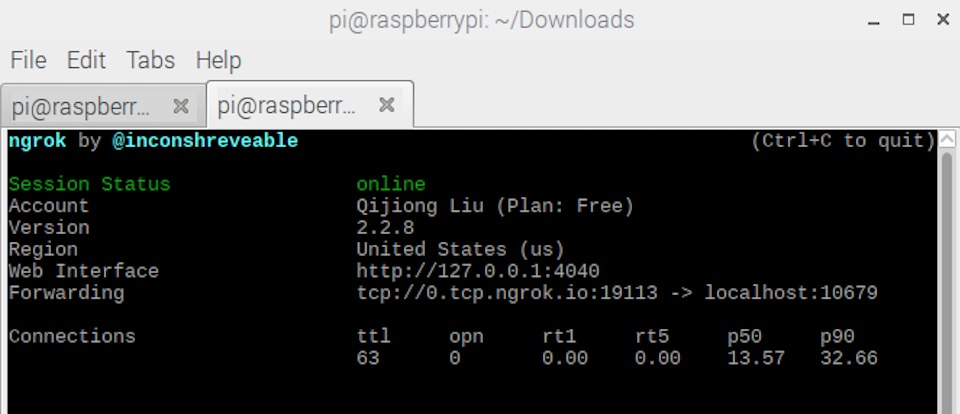

# Respberry+Shadowsocks+Ngrok实现科学上网
#### 工刀 Nov. 13, 2017

> 两个小伙伴说我的番茄服务器不能用了…
> 
> 前几天刚知道有个叫 `Ngrok` 的工具，可以实现公网访问内网，进行 HTTP/TCP 端口转发，而且不限速…
> 
> 来公司的路上想到手头正好有几个树莓派，正好可以做 SS 服务器…
> 
> （树莓派所在网络非公司内网，且我的账号有流量监控，仅实验性研究）

### 配置RespberryPi
用的树莓派3，自带 Wifi 模块。装了 `Respberry Pi Desktop` 系统。联网。

```
sudo apt-get update
sudo apt-get install python-pip
```

### 配置Shadowsocks服务端

```
sudo pip install shadowsocks
sudo ssserver -p 10679 -k password -m aes-256-cfb -d start
```
##### EVP\_CIPHER\_CTX\_cleanup错误
如果遇到`AttributeError: ... undefined symbol: EVP_CIPHER_CTX_cleanup`错误，打开`/usr/lib/python2.7/dist-packages/shadowsocks/crypto/openssl.py`文件。把所有的`EVP_CIPHER_CTX_cleanup`替换为`EVP_CIPHER_CTX_reset`。

### 配置Ngrok
在[Ngrok官网](https://ngrok.com/)注册账户，得到一个`AUTHTOKEN`。
下方的端口应和上方 SS 端口一致。

```
wget https://bin.equinox.io/c/4VmDzA7iaHb/ngrok-stable-linux-arm.zip
unzip ngrok-stable-linux-arm.zip
./ngrok authtoken AUTHTOKEN
./ngrok tcp 10679 
```
最终效果图如下。


### DNS解析

得到的是一个 `ngrok` 的的地址，如上`0.tcp.ngrok.io`，不如用`w.6-79.cn`进行别名解析。
由于国家政策，腾讯云不允许直接转发到`ngrok`，就先走到GoDaddy购买的 `w.679.today`，再跳转到`ngrok`。
